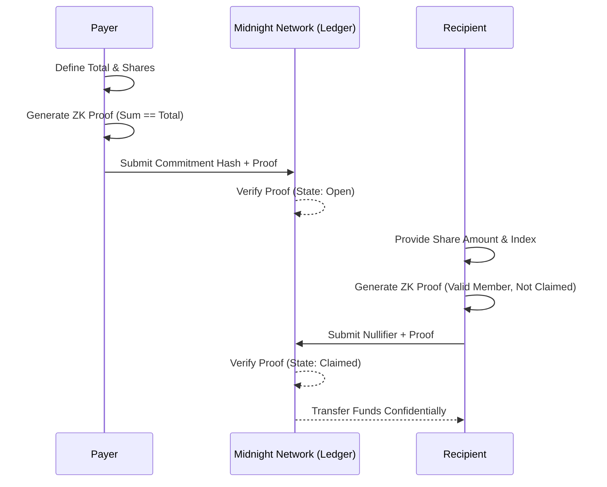

# Umbra (Project Title)


> Confidential payroll and revenue splits: prove every share adds up, without ever showing who got what.

## 🔗 Quick Links

- 🌐 **Live DApp:** [umbra-the-payment.vercel.app](https://umbra-the-payment.vercel.app)
- 🎥 **Video Walkthrough:** [Watch the Demo](https://drive.google.com/file/d/1HitWlEBr3wZ0YimV3IULD8aNofJOe42N/view?usp=sharing)
- 📜 **Deployed Contract:** [View on Midnight Explorer](https://preprod.midnightexplorer.com/contracts/0x4e73af2c0626a1d17de2452dc11e80a0f285bdb25fe88e82d5b8b2a8fa87d5e0)
- 🔎 **Example Tx:** [View on 1AM Explorer](https://explorer.1am.xyz/tx/9be7773f4ac661a799352325c6524dbff7807cae4dc4207c17aa3fc23ea5dd8a?network=preprod)
- 🐦 **X (Twitter):** [@umbraThePayment](https://x.com/umbraThePayment) | [Launch Thread](https://x.com/umbraThePayment/status/2104192068683727165)

## Mainnet / Testnet Contract Details

| Network | Address |
| Preprod | `4e73af2c0626a1d17de2452dc11e80a0f285bdb25fe88e82d5b8b2a8fa87d5e0` |

**View on Midnight Explorer**
[Contract 0x4e73af2c… | Midnight Explorer](https://preprod.midnightexplorer.com/contracts/0x4e73af2c0626a1d17de2452dc11e80a0f285bdb25fe88e82d5b8b2a8fa87d5e0)


**Example Transaction (1AM Explorer)**
[9be7773f4ac661a799352325c6524dbff7807cae4dc4207c17aa3fc23ea5dd8a](https://explorer.1am.xyz/tx/9be7773f4ac661a799352325c6524dbff7807cae4dc4207c17aa3fc23ea5dd8a?network=preprod)


## Project Description


Umbra is a confidential payroll and revenue-split dApp built on Midnight.
DAOs, freelance collectives, and revenue-share agreements currently have to
choose between paying everyone through a public ledger — exposing every
contributor's exact compensation — or moving payroll off-chain entirely and
losing verifiability. Umbra removes that tradeoff by utilizing Zero-Knowledge proofs to guarantee the mathematical integrity of a payroll distribution without leaking any underlying amounts.

## Project Vision

Anyone can build on Midnight, so a public payroll trail wouldn't just be
awkward — it would be a permanent, unerasable compensation leak. The vision for Umbra is to provide a trustless, on-chain payout infrastructure for distributed teams, DAOs, and agencies that maintains the absolute privacy of all individual compensation. We believe privacy is a fundamental right for workers, and on-chain payroll should not require sacrificing it.

## Key Features

- **Confidential Pool Sealing:** A payer commits a total payout pool and a set of per-recipient shares. A Compact circuit proves the shares sum exactly to the committed total before anything is written to the ledger.
- **Redacted Ledger Entries:** Only a commitment hash is ever published, never the total or any individual amount.
- **Private Claims:** Recipients prove they belong to the pool and haven't claimed before using a one-time nullifier, ensuring a share can never be double-claimed while keeping the claimant's identity and amount entirely private.
- **Trustless Settlement:** Anyone can independently verify that a pool is correctly and fully settled with zero disclosure of individual compensation.

## Future Scope

- **Multi-Asset Support:** Expanding beyond the native DUST token to support confidential stablecoins for payroll.
- **Dynamic Vesting:** Incorporating time-locked vesting schedules directly into the ZK proofs.
- **Automated Distributions:** Integrating with external oracle triggers to automatically seal and fund pools based on on-chain revenue.

## Architecture Diagrams



## User Onboarding Detail

**Try the Live DApp:** [https://umbra-the-payment.vercel.app](https://umbra-the-payment.vercel.app)
**Watch the Walkthrough:** [Demo on Google Drive](https://drive.google.com/file/d/1HitWlEBr3wZ0YimV3IULD8aNofJOe42N/view?usp=sharing)


1. **Install the 1AM Wallet:** Install the 1AM Wallet extension and set the network to Preprod.
2. **Fund Your Wallet:** Ensure you have testnet DUST (or the relevant test token) to pay for transaction fees.
3. **Connect to Umbra:** Navigate to the live DApp and click "Connect 1AM Wallet".
4. **Seal a Pool:** As a payer, enter a total amount and the breakdown of shares for the recipients. Click "Seal Pool" to generate the proof and submit the commitment.
5. **Claim a Share:** As a recipient, enter the Pool ID, your specific recipient index, and your private share amount. Click "Prove & Claim" to generate your proof and withdraw your funds confidentially.

## Social Media handle links

- **X (Twitter) Profile:** [@umbraThePayment](https://x.com/umbraThePayment)
- **Launch Thread:** [Read our launch announcement!](https://x.com/umbraThePayment/status/2104192068683727165)

---

### Tech Stack & Developer Setup

- **Contract:** Compact (Midnight smart contract language)
- **Frontend:** React 18, TypeScript, Vite, Tailwind CSS
- **Wallet:** Lace/1AM (Midnight wallet connector)
- **Testing:** Vitest — unit tests mirroring the circuits
- **CI/CD:** GitHub Actions

### Setup & Run Locally

```bash
git clone https://github.com/YOUR_GITHUB_USERNAME/umbra-payroll.git
cd umbra-payroll
npm install
compact compile contracts/umbra-payroll.compact managed/
npm run dev
```

### Run Tests

```bash
npm test
```
